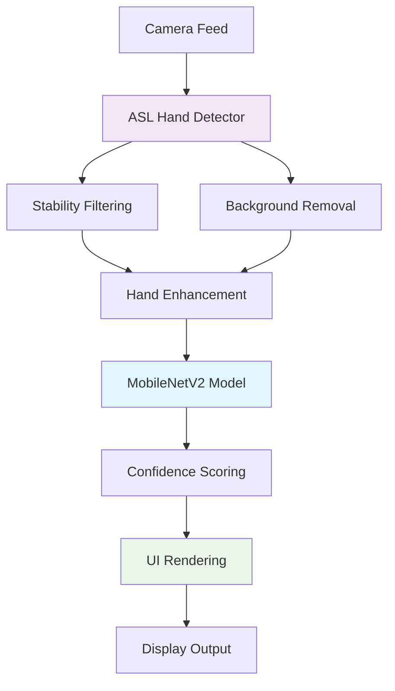

# Live ASL Recognition System Guide

## Overview

The Live ASL Recognition System integrates real-time camera hand detection with our trained deep learning model to provide live American Sign Language letter recognition. The system is designed for real-time performance with 30 FPS target on standard hardware.

## Features

### 🎯 Core Functionality
- **Real-time ASL Recognition**: Live letter prediction using trained MobileNetV2 model
- **Advanced Hand Detection**: ASL-optimized hand detector with stability filtering
- **Enhanced Image Processing**: Improved hand segmentation and preprocessing
- **Performance Monitoring**: Real-time FPS and inference time tracking
- **Interactive Controls**: Pause, reset, statistics toggle

### 🔧 Technical Features
- **Stability Filtering**: Reduces jitter and false predictions
- **Background Removal**: Optional background subtraction for better hand isolation
- **Hand Enhancement**: Automatic contrast and sharpening for better recognition
- **Device Support**: Automatic GPU/CPU detection and usage
- **Confidence Scoring**: Real-time confidence visualization

## Architecture

### Project Structure
```
src/asl_cam/
├── live_asl.py              # Main live recognition system
└── vision/
    ├── simple_hand_detector.py    # Basic MediaPipe hand detection
    ├── asl_hand_detector.py       # ASL-optimized detector
    └── background_removal.py      # Background subtraction

src/asl_dl/
├── models/
│   ├── mobilenet.py               # MobileNetV2 architecture
│   └── asl_abc_model.pth         # Trained model weights
└── ...

run_live_asl.py             # Main launcher script
```

### Component Integration



## Installation & Setup

### Prerequisites
```bash
# Ensure all dependencies are installed
pip install -r requirements.txt

# Key packages:
# - opencv-python
# - torch
# - torchvision
# - mediapipe
# - numpy
```

### Model Requirements
The system requires a trained model at `src/asl_dl/models/asl_abc_model.pth`. If you don't have one:

```bash
# Train the ABC model first
python src/asl_dl/scripts/train_abc.py
```

## Usage

### Quick Start
```bash
# Launch the live ASL recognition system
python run_live_asl.py
```

### Interactive Controls

| Key | Action | Description |
|-----|--------|-------------|
| `Q` | Quit | Exit the application |
| `S` | Toggle Stats | Show/hide performance statistics |
| `R` | Reset Tracker | Reset hand detection and stability |
| `B` | Reset Background | Reset background subtraction model |
| `SPACE` | Pause/Resume | Pause/resume video processing |

### Performance Indicators

#### Hand Detection Status
- **Green Box**: Hand detected and stable (good for recognition)
- **Orange Box**: Hand detected but unstable (may cause jitter)

#### Confidence Visualization
- **Green Bar**: High confidence (>80%) - Very reliable prediction
- **Yellow Bar**: Medium confidence (60-80%) - Fairly reliable
- **Orange Bar**: Low confidence (<60%) - Less reliable

#### Statistics Display
- **FPS**: Current frames per second
- **Inference**: Model inference time in milliseconds
- **Device**: Processing device (CPU/GPU)

## System Components

### LiveASLRecognizer Class
Main orchestrator that coordinates all components:

```python
class LiveASLRecognizer:
    """
    Live ASL Recognition System
    
    Features:
    - Model loading and inference
    - Camera integration
    - Performance monitoring
    - UI rendering
    """
```

#### Key Methods
- `load_model()`: Load trained PyTorch model
- `predict_hand_sign()`: Perform ASL letter prediction
- `draw_ui()`: Render user interface
- `run()`: Main execution loop

### ASLHandDetector Class
Enhanced hand detection optimized for ASL:

```python
class ASLHandDetector(SimpleHandDetector):
    """
    ASL-optimized hand detector with:
    - Stability filtering
    - Enhanced preprocessing
    - Background removal integration
    """
```

#### Key Features
- **Stability Tracking**: Filters out jittery detections
- **Hand Enhancement**: Improves image quality for ML model
- **Background Integration**: Optional background subtraction
- **Robust Detection**: Better handling of ASL hand poses

## Performance Optimization

### Target Performance
- **Frame Rate**: 30 FPS on standard hardware
- **Inference Time**: <50ms per prediction
- **Detection Latency**: <100ms end-to-end

### Optimization Strategies

#### 1. Model Optimization
- MobileNetV2 architecture for speed
- Optimized input resolution (224x224)
- Efficient preprocessing pipeline

#### 2. Detection Optimization
- Stability filtering reduces unnecessary predictions
- Background removal improves detection quality
- Hand enhancement optimizes model input

#### 3. System Optimization
- GPU acceleration when available
- Efficient OpenCV operations
- Minimal memory allocation in loops

## Troubleshooting

### Common Issues

#### 1. Model Not Found
```
❌ Model not found: src/asl_dl/models/asl_abc_model.pth
💡 Train a model first with: python src/asl_dl/scripts/train_abc.py
```
**Solution**: Train the model first using the training script.

#### 2. Camera Access Issues
```
❌ Cannot open camera
```
**Solution**: 
- Check camera permissions
- Ensure no other application is using the camera
- Try different camera index (change `cv2.VideoCapture(0)` to `cv2.VideoCapture(1)`)

#### 3. Poor Detection Performance
**Symptoms**: Hand not detected or unstable detection
**Solutions**:
- Ensure good lighting conditions
- Use plain background
- Keep hand in frame center
- Press `B` to reset background model
- Press `R` to reset hand tracker

#### 4. Low FPS Performance
**Symptoms**: Choppy video, low FPS display
**Solutions**:
- Close other applications
- Reduce camera resolution
- Use GPU if available
- Check system resources

#### 5. Prediction Accuracy Issues
**Symptoms**: Wrong letters predicted, low confidence
**Solutions**:
- Ensure hand is stable (wait for green box)
- Form clear ASL letters
- Good lighting and contrast
- Retrain model with more data

### Debug Mode

Enable detailed logging:
```python
import logging
logging.basicConfig(level=logging.DEBUG)
```

## Advanced Configuration

### Camera Settings
Modify camera parameters in `LiveASLRecognizer.run()`:
```python
cap.set(cv2.CAP_PROP_FRAME_WIDTH, 1280)   # Width
cap.set(cv2.CAP_PROP_FRAME_HEIGHT, 720)   # Height
cap.set(cv2.CAP_PROP_FPS, 30)             # FPS
```

### Detection Parameters
Adjust ASL detector sensitivity:
```python
self.hand_detector = ASLHandDetector(
    min_detection_confidence=0.7,    # Detection threshold
    min_tracking_confidence=0.5,     # Tracking threshold
    stability_frames=3                # Stability window
)
```

### Model Parameters
Modify prediction behavior:
```python
# Confidence threshold for display
if confidence > 0.6:  # Adjust threshold
    # Show prediction
```

## Development Guidelines

### Adding New Features
1. **Maintain Clean Separation**: Keep camera logic in `asl_cam`, ML in `asl_dl`
2. **Performance First**: Profile any new features for performance impact
3. **User Experience**: Ensure real-time responsiveness
4. **Error Handling**: Graceful degradation for missing components

### Testing
```bash
# Test hand detection
python -m pytest src/asl_cam/tests/test_enhanced_hand_detector.py

# Test live system components
python src/asl_cam/live_asl.py  # Manual testing
```

### Code Organization
- **Single Responsibility**: Each class has one clear purpose
- **Clean Interfaces**: Simple, well-documented APIs
- **Organized Imports**: Clear separation of camera vs ML imports
- **Error Handling**: Comprehensive logging and error recovery

## Future Enhancements

### Planned Features
- [ ] **Multi-letter Words**: Sequence recognition for complete words
- [ ] **Dynamic Gesture Recognition**: Support for motion-based ASL
- [ ] **Multiple Hand Support**: Two-handed ASL letters
- [ ] **Real-time Training**: Online learning from user corrections
- [ ] **Mobile Support**: Android/iOS deployment
- [ ] **Web Interface**: Browser-based recognition system

### Performance Improvements
- [ ] **Model Quantization**: Reduce model size and inference time
- [ ] **TensorRT/ONNX**: Hardware-optimized inference
- [ ] **Edge Device Support**: Raspberry Pi, Jetson Nano deployment
- [ ] **Batch Processing**: Process multiple hands simultaneously

## Contributing

### Development Setup
1. Clone the repository
2. Install dependencies: `pip install -r requirements.txt`
3. Train the model: `python src/asl_dl/scripts/train_abc.py`
4. Test the system: `python run_live_asl.py`

### Code Style
- Follow existing patterns in the codebase
- Use type hints for better code documentation
- Add comprehensive docstrings
- Include error handling and logging

### Testing
- Test on different hardware configurations
- Verify performance metrics
- Test with various lighting conditions
- Validate accuracy with different users

---

**Author**: CV-ASL Team  
**Version**: 1.0  
**Last Updated**: January 2025 